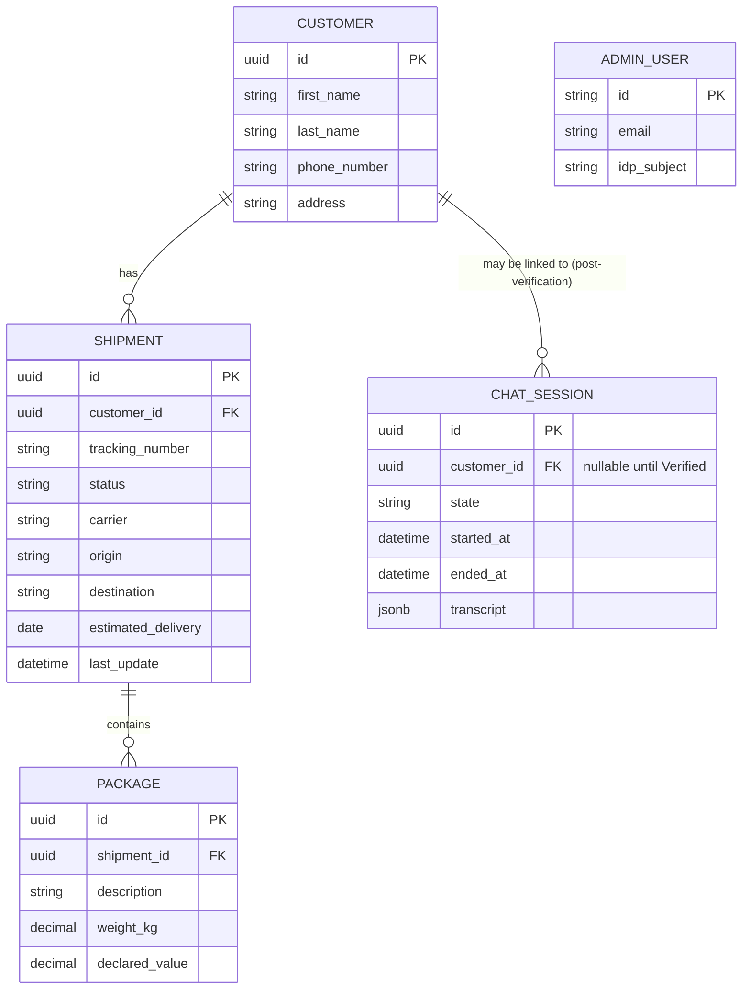

# Data Model (ERD)

Starting reference, copied from `SecureShip-5Week-Program.md` Section 6.4. See Section 4.4 for the mock data schema and Section 4.6 for the `CHAT_SESSION.transcript` JSONB column.

> `ADMIN_USER` identity actually lives in Auth0; this row in the local DB (if mirrored) is a reference/audit record only, not the source of truth for credentials.
