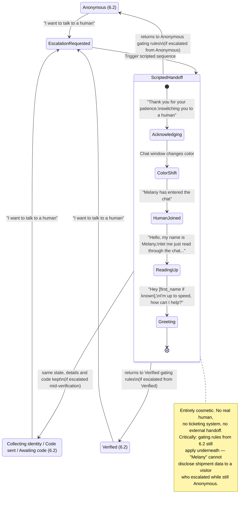

# Human Escalation Sequence (Epic G — cosmetic, scripted)

Starting reference, copied from `SecureShip-5Week-Program.md` Section 6.2b. Implemented in Week 2, alongside the state machine.

As implemented (`backend/app/services/escalation.py`):
- Escalation can be requested from any 6.2 state, including mid identity collection and while a code is pending (G1 "at any point"). Collected details and any code in flight are kept.
- It never changes the session `state` or `customer_id`: the handoff lines are recorded in the transcript tagged `event: "escalated_to_human"`, so "returning" to the gating rules is automatic. The `escalated_to_human` state value is unused.
- The backend returns the script lines; the frontend plays them on a timer and shifts the window color.
- Asking again after escalating gets one line ("You're already chatting with Melany") instead of the full sequence.

