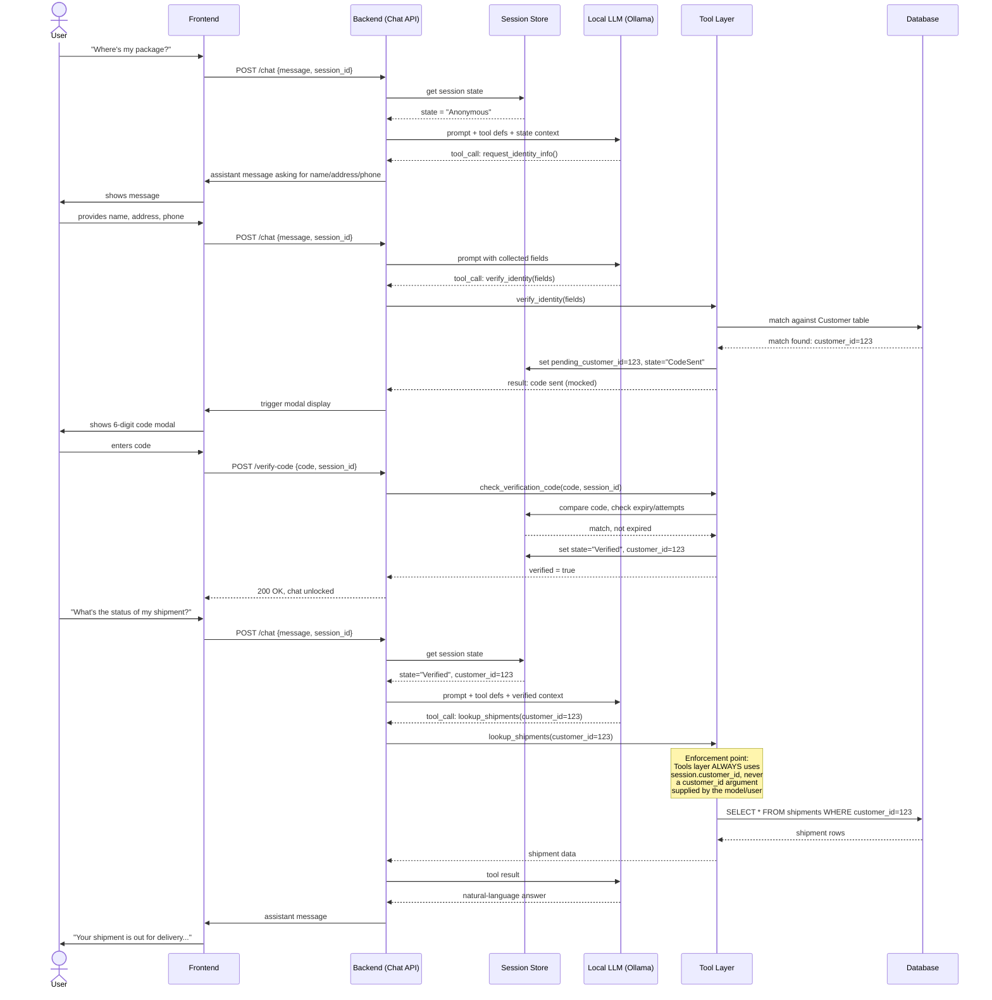

# Tool-Calling Sequence — HTTP (the gating enforcement point)

Starting reference, copied from `SecureShip-5Week-Program.md` Section 6.3. Shows *why* enforcement must live in the backend tool layer, not the model's prompt. Implemented in Week 3.

